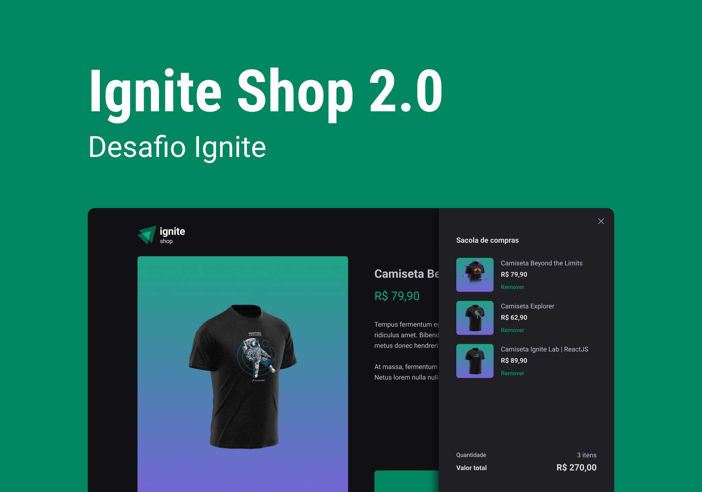

<h1 align='center'>
    Ignite Shop
    <br />
    <br />
    
</h1>
<br />

## 🎯 Objetivo
Este projeto foi deselvolvido para o meu estudo próprio de Next.js. É um site que simula uma loja online de venda de camisetas do mundo tech, indo desde o catálogo de produtos até a verificação de credenciais de compra do usuário.

## 🧪 Tecnologias
- [React](https://react.dev/)
- [Typescript](https://www.typescriptlang.org/)
- [Next.js](https://nextjs.org/)
- [Stripe](https://stripe.com/)
- [Chakra Ui](https://v2.chakra-ui.com/)

## 🚀 Como executar

### Pré requisitos
Antes da execução do projeto, será necessário ter instalado em sua máquina as seguintes ferramentas:

- [Git](https://git-scm.com/)
- [NPM](https://www.npmjs.com/)
- [NodeJS](https://nodejs.org/)

Além disso, será necessário criar uma conta no [Stripe](https://stripe.com/) e adicionar as suas chaves em um arquivo .env ou .env.local na raiz do projeto, do seguinte jeito:
```bash
STRIPE_PUBLIC_KEY=<SUA_CHAVE_PUBLICA_STRIPE>

STRIPE_SECRET_KEY=<SUA_CHAVE_SECRETA_STRIPE>
```

### Rodando a aplicação localmente
Por fim, para inicializar a aplicação em localhost, siga estes passos:
```bash
# Clone o projeto no seu computador
$ git clone https://github.com/pdanmt/Ignite-Shop

# Abra a pasta do projeto
$ cd Ignite-Shop

# Instale as dependências
$ npm i

# Configure as variáveis ambientes, conforme já explicado

# Rodar o projeto
$ npm run dev
```
A aplicação será aberta na rota http://localhost:3000

## 📝 Layout
O figma do projeto pode ser acessado [clicando aqui](https://www.figma.com/design/RUNYohBZdYpJYfwyJL2X08/Ignite-Shop-2.0-%E2%80%A2-Desafio-React-(Copy)?node-id=2-12&t=eREunxtIIHkvX9Pr-0).

O resultado final do projeto pode ser visualizado [neste link](ignite-shop-pdd.vercel.app)

O design do projeto foi desenvolvido pelo pessoal da [Rocketseat](https://www.rocketseat.com.br/).